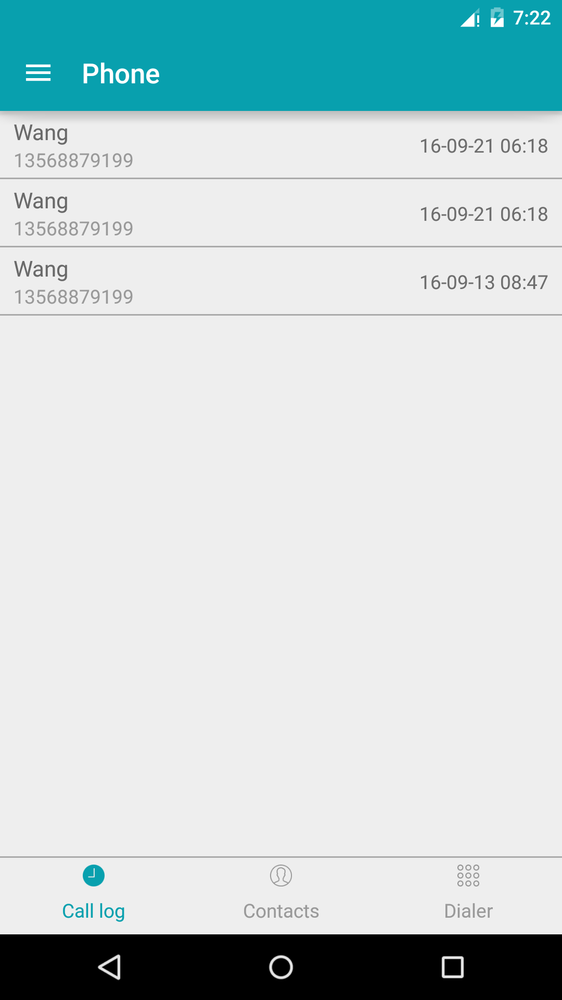
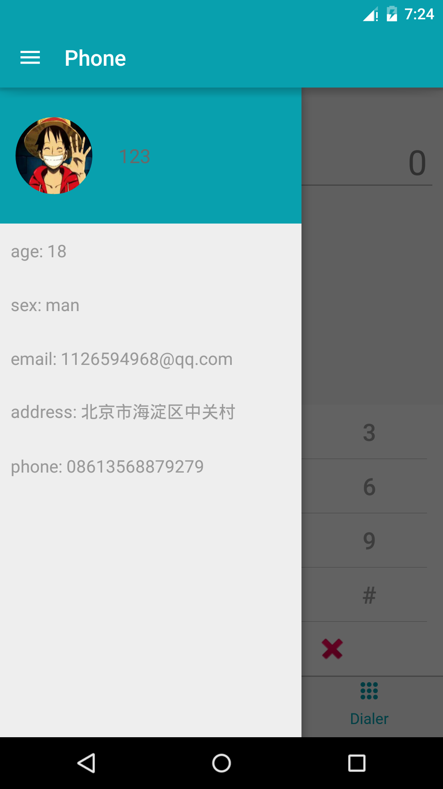

# DataBinding-Example
This shows how to use **[Data Binding Library](https://developer.android.com/topic/libraries/data-binding/index.html)** to develop a App.

## ScreenShot(Using ViewPager and RecyclerView with Data Binding Library)
<div>
<p>


</p>
</div>
        
        
<p></p>
## Listener Bindings
You can bind arbitrary listener you want. For example:
```
    <data class="UserBinding">

        <variable
            name="listener"
            type="com.wj.databinding.LoginActivity" />

    </data>
    
    ...
            <android.support.design.widget.TextInputLayout
                android:layout_width="match_parent"
                android:layout_height="wrap_content">

                <android.support.design.widget.TextInputEditText
                    android:id="@+id/login_username"
                    android:layout_width="match_parent"
                    android:layout_height="@dimen/size_45dp"
                    ...
                    app:addTextChangedListener="@{listener.addTextChangedListener}" />

            </android.support.design.widget.TextInputLayout>
    ...
```

```
    public final TextWatcher addTextChangedListener() {
        return new TextWatcher() {
            @Override
            public void beforeTextChanged(CharSequence s, int start, int count, int after) {

            }

            @Override
            public void onTextChanged(CharSequence s, int start, int before, int count) {

            }

            @Override
            public void afterTextChanged(Editable s) {
                
            }
        };
    }
```
The method addTextChangedListener is in the LoginActivity class.

## Collections
You can use collections in the layout. For example:
```
    <data class="FragmentDialBinding">

        <import type="java.util.ArrayList" />
        
        <variable
            name="list"
            type="ArrayList&lt;String&gt;" />
        
    </data>
    
    ...
            <LinearLayout
                android:layout_width="match_parent"
                android:layout_height="wrap_content"
                android:orientation="horizontal">

                <Button
                    style="@style/DialButton"
                    android:onClick="@{listener.onClick}"
                    android:text="@{list[0]}" />

                <Button
                    style="@style/DialButton"
                    android:onClick="@{listener.onClick}"
                    android:text="@{list[1]}" />

                <Button
                    style="@style/DialButton"
                    android:onClick="@{listener.onClick}"
                    android:text="@{list[2]}" />
            </LinearLayout>
    ...
```
```
        // fill data
        ArrayList<String> numbers = new ArrayList<>();
        numbers.add("1");
        numbers.add("2");
        numbers.add("3");
        mFragmentDialBinding.setList(numbers);
```
## include
Data binding supports include,and it's easy to use. For example:
```
<?xml version="1.0" encoding="utf-8"?>
<layout xmlns:android="http://schemas.android.com/apk/res/android"
    xmlns:bind="http://schemas.android.com/apk/res-auto">

    <data>

    <variable
        name="value"
        type="java.lang.String" />

</data>

    <FrameLayout
        android:layout_width="match_parent"
        android:layout_height="match_parent">

        <include
            layout="@layout/user"
            bind:value="@{value}" />

    </FrameLayout>
</layout>

```
user.xml
```
<?xml version="1.0" encoding="utf-8"?>
<layout xmlns:android="http://schemas.android.com/apk/res/android"
    xmlns:app="http://schemas.android.com/apk/res-auto">

    <data>

        <variable
            name="value"
            type="java.lang.String" />

    </data>

    <FrameLayout
        android:layout_width="match_parent"
        android:layout_height="match_parent">

        ...
        <Button
            android:layout_width="wrap_content"
            android:layout_height="wrap_content"
            android:text="@{value}" />
    </FrameLayout>


</layout>
```
Note: you should call the method setValue to pass the Variable's value into the included layout.


